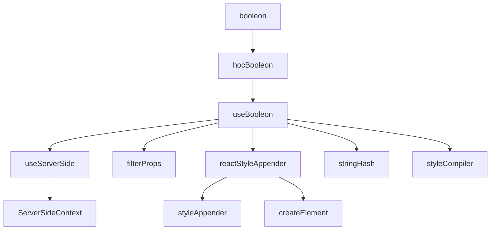

import { Snippet } from '@booleon/ui';

```tsx
const regex = /\d1.*/g;

type Type = any;

const arrowFunction = ({ blue }: Type) => <Component color={blue} />;

/**
 * comment
 * @example example
 */
function FunctionComponent({ blue }: any) {
  return <Component color={blue} />;
}
```


