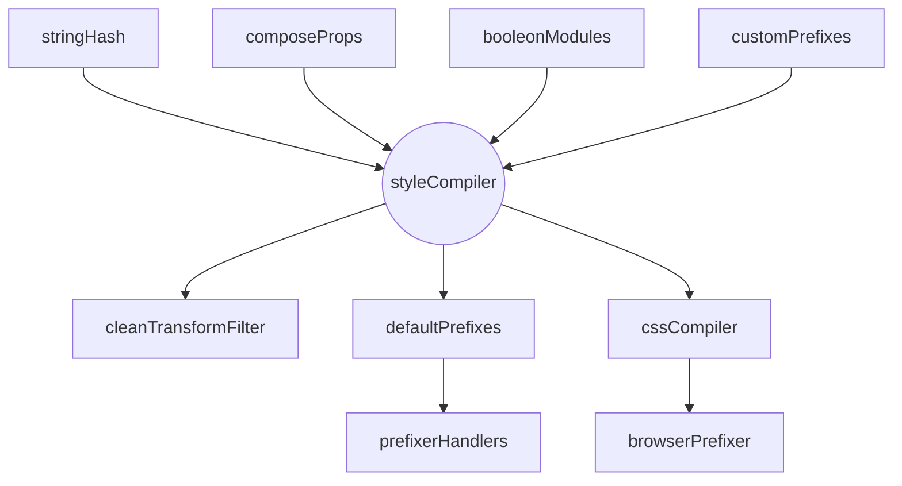

# Core

```mermaid
  graph TD

  stringHash[stringHash] --> styleCompiler((styleCompiler))
  composeProps[composeProps] --> styleCompiler((styleCompiler))
  booleonModules[booleonModules] --> styleCompiler((styleCompiler))
  customPrefixes[customPrefixes] --> styleCompiler((styleCompiler))

  styleCompiler((styleCompiler)) --> cleanTransformFilter[cleanTransformFilter]
  styleCompiler((styleCompiler)) --> defaultPrefixes[defaultPrefixes] --> prefixerHandlers[prefixerHandlers]
  styleCompiler((styleCompiler)) --> cssCompiler[cssCompiler] --> browserPrefixer[browserPrefixer]

  click styleCompiler "/docs/core/#styleCompiler" "styleCompiler"
  click stringHash "/docs/core/#stringHash" "stringHash"
  click composeProps "/docs/core/#composeProps" "composeProps"
  click booleonModules "/docs/modules" "booleonModules"
  click customPrefixes "/docs/core/#customPrefixes" "customPrefixes"
  click cleanTransformFilter "/docs/core/#cleanTransformFilter" "cleanTransformFilter"
  click defaultPrefixes "/docs/core/#defaultPrefixes" "defaultPrefixes"
  click prefixerHandlers "/docs/core/#prefixerHandlers" "prefixerHandlers"
  click cssCompiler "/docs/core/#cssCompiler" "cssCompiler"
  click browserPrefixer "/docs/core/#browserPrefixer" "browserPrefixer"
```